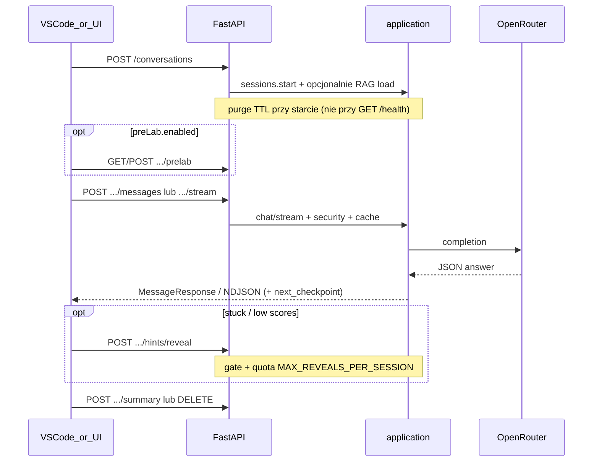

# Architektura

Warstwy i przepływ HTTP mikroserwisu PJA-Sensei AI Module.

- Endpointy i przykłady: [API.md](API.md)
- Pakiety (mapa kodu): [CODEMAP.md](CODEMAP.md)
- Testy i edge case’y: [TESTING.md](TESTING.md)

## Warstwy i importy

```text
api  →  application  →  ports / domain / core
                 ↘ adapters tylko w composition root (AppContainer)
```

| Warstwa | Rola | Może importować |
|---------|------|-----------------|
| `app/api` | HTTP: routery, deps, middleware, schematy FastAPI | `application`, `domain`, `core`; webhooks z routerów (tło) |
| `app/application` | Use-case’y (chat, sessions, …); DI przez konstruktory | `ports`, `domain`, `core`, własne `dto` |
| `app/ports` | Protocoly (LLM, RAG, cache, security, summary, ConversationRepository) | `domain` (typy) |
| `app/adapters` | I/O: OpenRouter, Chroma, cache, security, webhooks, sesje w RAM | `domain`, `core` |
| `app/domain` | Modele i reguły bez HTTP/LLM | tylko stdlib / pydantic |
| `app/core` | Konfiguracja env, JWT, metryki, rate limit | stdlib / pydantic-settings |

**Composition root:** `AppContainer` tworzy adaptery i wstrzykuje je do serwisów. Use-case **nie** przyjmuje `AppContainer`.

**Kontener HTTP:** `app.state.container` (lifespan) → `get_container(request)`. Testy: `create_app(container=…)`.

**Zakaz:** `application` → `api` (DTO w `app/application/dto.py`); `application` → concrete `adapters` poza containerem.

## Publiczne vs chronione

| | Ścieżki | Middleware |
|--|--------|------------|
| **Publiczne** | `/`, `/health`, `/healthz`, `/metrics`, `/metrics/prometheus` | bez JWT / rate limit |
| **Chronione** | `/conversations…`, `/validate-config` | `require_auth` + `enforce_rate_limit` |

`GET /health` to sonda stanu (bez GC sesji). Purge TTL jest przy `POST /conversations`.

Pełna tabela endpointów: [API.md](API.md).

## Happy-path sesji



1. `POST /conversations` — `problem_description` + `SenseiConfig` (+ tło RAG).
2. Opcjonalnie pre-lab (gate 403 na chat, dopóki nie zaliczony).
3. `POST …/messages` lub `…/messages/stream` — może zwrócić `goal_progress` + `next_checkpoint`.
4. Opcjonalnie: `events`, `feedback`, `hints/reveal`, `export`, `checkpoints`.
5. `POST …/summary` i/lub `DELETE` (soft summary + webhook).

## Bramki wiadomości

Kolejność w `validate_message_request` (`app/api/deps.py`):

1. Istnienie konwersacji (404).
2. Pre-lab zaliczony (`PrelabRequired` → 403).
3. Budżet tokenów (`TokenBudgetExceeded` → 403; soft summary w tle).
4. File-context gdy `requireFileContextForChat` (`message_id: rejected`, bez LLM; tryb **theory** omija).
5. Security gate — jailbreak / injection (`message_id: blocked`).
6. Dopiero potem chat / stream (cache, pedagogy gates, LLM).

Rate limit i JWT na chronionym routerze działają **przed** handlerem.

## Webhooki

| Zdarzenie | URL |
|-----------|-----|
| `message` (sync i stream `final`), `ide_event` | `TELEMETRY_URL` |
| `session_summary` (summary / soft DELETE) | `SUMMARY_WEBHOOK_URL` (jeśli puste → `TELEMETRY_URL`) |

## Sesje i limity

- Konwersacje **w RAM** — trwały store wymaga osobnej decyzji produktowej.
- TTL / cap: `CONVERSATION_TTL_SECONDS`, `MAX_CONVERSATIONS` (purge przy starcie sesji).
- Cache: exact-match in-memory; RAG: Chroma per rozmowa.

## Kontrakty

| Artefakt | Ścieżka |
|----------|---------|
| SenseiConfig (JSON Schema) | `schemas/sensei-config.schema.json` |
| Modele Pydantic | `app/domain/sensei.py` |
| OpenAPI snapshot | `schemas/openapi.json` / `.yaml` |
| Przykłady HTTP | [API.md](API.md)#przyklady |

SenseiConfig: **camelCase** w polach IDE — nie zmieniać bez sync klienta.

### Nie mylić z usuniętymi trasami API slim

| W config / domenie | To NIE jest usunięty endpoint |
|--------------------|-------------------------------|
| `learningContext.goals` | Cele labu; postęp aktualizuje chat |
| `checkpoints` | `GET …/checkpoints` nadal istnieje |
| `agentBehavior.mode: "review"` | Tryb promptu, nie `POST /review` |
